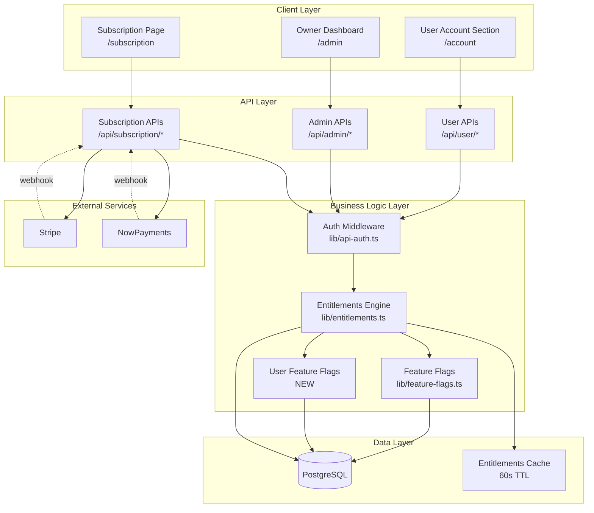
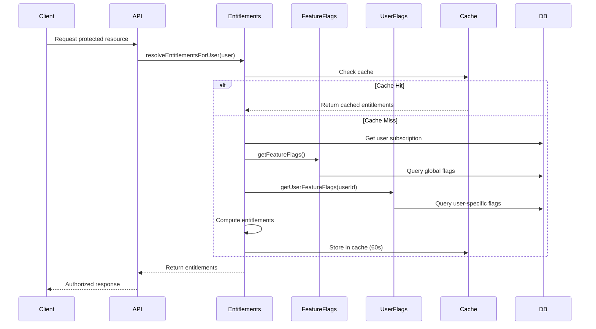
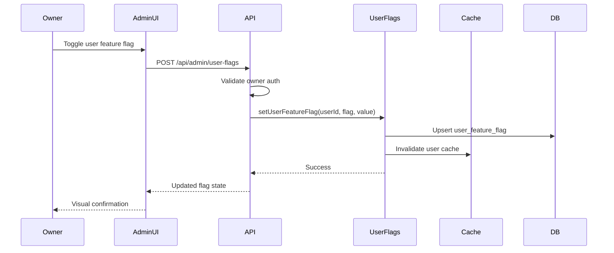
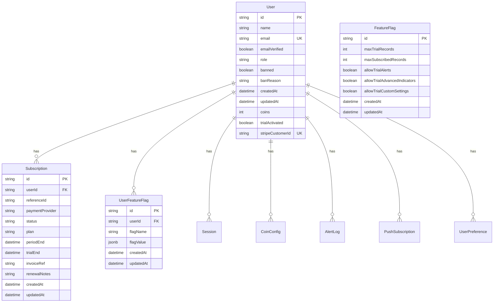

# Design Document: Enhanced User Management and Subscription System

## Overview

This design document specifies the architecture, components, and implementation strategy for an enhanced user management and subscription system that extends the existing RSIQ platform with granular per-user feature control, dual interface architecture, and seamless subscription lifecycle management.

### System Context

The enhanced user management system builds upon the existing infrastructure:
- **Authentication**: Better-auth with session management
- **Database**: PostgreSQL with Prisma ORM
- **Payment Processing**: Stripe (primary) and NowPayments (crypto)
- **Feature Flags**: Global feature flag system in `lib/feature-flags.ts`
- **Entitlements**: Tier-based access control in `lib/entitlements.ts`
- **Admin Panel**: Owner dashboard at `/admin`

### Key Design Principles

1. **Separation of Concerns**: Clear boundaries between user-facing and owner-facing interfaces
2. **Backward Compatibility**: Extend existing systems without breaking current functionality
3. **Performance**: Optimize database queries with proper indexing and caching
4. **Security**: Enforce strict access control with owner-only administrative functions
5. **Scalability**: Design for growth with efficient data structures and query patterns
6. **User Experience**: Provide intuitive interfaces with clear feedback and error handling

### High-Level Architecture



### Design Goals Achievement

| Goal | Implementation Strategy |
|------|------------------------|
| Next.js 14+ App Router | Use server components for data fetching, client components for interactivity |
| TypeScript Strict Mode | Define comprehensive type interfaces for all data structures |
| Clean Architecture | Separate presentation, business logic, and data access layers |
| Scalability | Implement database indexing, query optimization, and caching strategies |
| Existing Patterns | Extend `lib/entitlements.ts` and `lib/feature-flags.ts` without breaking changes |
| Prisma Integration | Use Prisma for type-safe queries with raw SQL fallback for feature flags |
| Authentication | Leverage `authClient.useSession()` and `requireOwner()` middleware |
| Dark Theme | Follow existing `#05080F` background and `#39FF14` accent color scheme |
| Mobile-First | Implement responsive layouts with Tailwind CSS breakpoints |
| Error Handling | Provide user-friendly messages with proper logging and fallback states |

## Architecture

### Component Architecture

The system follows a layered architecture with clear separation between presentation, business logic, and data access:

**Presentation Layer**
- User Account Section (`/account`): User-facing subscription and account management
- Owner Dashboard (`/admin`): Administrative interface for user and feature flag management
- Subscription Page (`/subscription`): Plan selection and payment processing

**API Layer**
- User APIs: Account information, preferences, billing history
- Admin APIs: User management, feature flag control, manual renewals
- Subscription APIs: Checkout, status, webhook handling

**Business Logic Layer**
- Entitlements Engine: Compute user access based on subscription and feature flags
- Feature Flags: Global and per-user feature flag management
- Authentication: Session validation and authorization checks

**Data Access Layer**
- Prisma ORM: Type-safe database queries
- Raw SQL: Feature flag operations for backward compatibility
- Caching: In-memory entitlements cache with 60-second TTL

### Data Flow Patterns

#### User Entitlements Resolution



#### Feature Flag Update Flow



### Security Architecture

**Authentication Flow**
1. Client requests protected resource
2. API extracts session from headers
3. `getSessionUser()` validates session and retrieves user
4. `requireOwner()` checks for owner privileges (admin endpoints only)
5. API processes request with authenticated context

**Authorization Layers**
- **Anonymous**: No authentication required (landing pages, public content)
- **Authenticated**: Valid session required (user account, terminal access)
- **Subscribed**: Active subscription or trial required (premium features)
- **Owner**: Super admin email or owner role required (admin panel, user management)

**Access Control Matrix**

| Resource | Anonymous | Authenticated | Subscribed | Owner |
|----------|-----------|---------------|------------|-------|
| Landing Pages | ✓ | ✓ | ✓ | ✓ |
| User Account | ✗ | ✓ | ✓ | ✓ |
| Terminal (Trial) | ✗ | ✓ | ✓ | ✓ |
| Terminal (Full) | ✗ | ✗ | ✓ | ✓ |
| Owner Dashboard | ✗ | ✗ | ✗ | ✓ |
| User Management | ✗ | ✗ | ✗ | ✓ |
| Feature Flags | ✗ | ✗ | ✗ | ✓ |

## Components and Interfaces

### Database Schema Design

#### New Table: `user_feature_flag`

```sql
CREATE TABLE "user_feature_flag" (
  "id" TEXT PRIMARY KEY DEFAULT gen_random_uuid(),
  "userId" TEXT NOT NULL,
  "flagName" TEXT NOT NULL,
  "flagValue" JSONB NOT NULL,
  "createdAt" TIMESTAMP NOT NULL DEFAULT NOW(),
  "updatedAt" TIMESTAMP NOT NULL DEFAULT NOW(),
  
  CONSTRAINT "user_feature_flag_userId_fkey" 
    FOREIGN KEY ("userId") REFERENCES "user"("id") ON DELETE CASCADE,
  CONSTRAINT "user_feature_flag_userId_flagName_key" 
    UNIQUE ("userId", "flagName")
);

CREATE INDEX "user_feature_flag_userId_idx" ON "user_feature_flag"("userId");
CREATE INDEX "user_feature_flag_flagName_idx" ON "user_feature_flag"("flagName");
```

**Design Rationale**:
- `JSONB` type for `flagValue` supports boolean, numeric, and future complex flag types
- Composite unique constraint prevents duplicate flags per user
- Indexes on `userId` and `flagName` optimize common query patterns
- Cascade delete ensures cleanup when users are removed
- `updatedAt` tracks when flags were last modified for audit purposes

#### Schema Extensions

**User Table** (existing, no changes required):
- Already has `id`, `email`, `role`, `createdAt`, `banned`, `banReason`
- `trialActivated` field exists but not currently used (can be leveraged)

**Subscription Table** (existing, no changes required):
- Already has all required fields for subscription lifecycle management
- `invoiceRef` and `renewalNotes` support manual renewal tracking

**FeatureFlag Table** (existing, no changes required):
- Global feature flags already implemented
- Will be extended with per-user override logic

### TypeScript Interfaces

```typescript
// User Feature Flag Types
export interface UserFeatureFlag {
  id: string;
  userId: string;
  flagName: string;
  flagValue: boolean | number;
  createdAt: Date;
  updatedAt: Date;
}

export type UserFeatureFlagName =
  | "allowAdvancedIndicators"
  | "allowAlerts"
  | "allowCustomSettings"
  | "maxRecords"
  | "maxSymbols";

export interface UserFeatureFlagInput {
  userId: string;
  flagName: UserFeatureFlagName;
  flagValue: boolean | number;
}

// Extended Entitlements with User Flags
export interface ResolvedEntitlements {
  tier: EntitlementTier;
  isOwner: boolean;
  hasPaidAccess: boolean;
  isTrialing: boolean;
  maxRecords: number;
  availableRecordOptions: number[];
  features: {
    enableAlerts: boolean;
    enableAdvancedIndicators: boolean;
    enableCustomSettings: boolean;
  };
  coins: number;
  maxSymbols: number;
  flags: FeatureFlags;
  userFlags?: Partial<Record<UserFeatureFlagName, boolean | number>>;
}

// Admin User Management Types
export interface AdminUser {
  id: string;
  name: string;
  email: string;
  role: string | null;
  createdAt: Date;
  banned: boolean | null;
  banReason: string | null;
  subscription: AdminSubscription | null;
  effectiveFlags: EffectiveFlags;
}

export interface AdminSubscription {
  id: string;
  status: string;
  plan: string;
  periodEnd: Date | null;
  invoiceRef: string | null;
  renewalNotes: string | null;
}

export interface EffectiveFlags {
  allowAdvancedIndicators: { value: boolean; source: "global" | "user" };
  allowAlerts: { value: boolean; source: "global" | "user" };
  allowCustomSettings: { value: boolean; source: "global" | "user" };
  maxRecords: { value: number; source: "global" | "user" };
  maxSymbols: { value: number; source: "global" | "user" };
}

// User Account Types
export interface UserAccountData {
  user: {
    id: string;
    name: string;
    email: string;
    createdAt: Date;
  };
  subscription: {
    status: "trial" | "active" | "past_due" | "cancelled" | "none";
    plan: string | null;
    periodEnd: Date | null;
    trialDaysRemaining: number | null;
  };
  billing: {
    history: BillingHistoryItem[];
    nextBillingDate: Date | null;
    paymentMethod: string | null;
  };
}

export interface BillingHistoryItem {
  id: string;
  date: Date;
  amount: number;
  status: "paid" | "pending" | "failed";
  invoiceUrl: string | null;
  description: string;
}
```

### Component Hierarchy

```
app/
├── account/
│   └── page.tsx                    # User Account Section (NEW)
│       ├── AccountHeader
│       ├── SubscriptionStatus
│       ├── TrialIndicator
│       ├── BillingHistory
│       └── AccountSettings
│
├── admin/
│   └── page.tsx                    # Owner Dashboard (ENHANCED)
│       ├── AdminHeader
│       ├── UserList
│       │   ├── UserCard
│       │   │   ├── UserInfo
│       │   │   ├── SubscriptionBadge
│       │   │   ├── FeatureFlagToggles (NEW)
│       │   │   └── UserActions
│       │   └── UserSearch
│       ├── ManualRenewalForm
│       ├── GlobalFeatureFlagsPanel
│       └── AnalyticsDashboard (NEW)
│
└── subscription/
    └── page.tsx                    # Subscription Page (EXISTING)
        ├── PlanCard
        ├── PaymentMethodSelector
        └── CheckoutFlow

components/
├── user-account/                   # NEW
│   ├── subscription-status-card.tsx
│   ├── trial-countdown.tsx
│   ├── billing-history-table.tsx
│   └── account-settings-form.tsx
│
└── admin/                          # NEW
    ├── user-feature-flag-toggle.tsx
    ├── effective-flags-display.tsx
    ├── analytics-card.tsx
    └── manual-renewal-form.tsx
```

### API Endpoints Specification

#### User Account APIs

**GET /api/user/account**
- **Purpose**: Retrieve user account information including subscription and billing
- **Auth**: Authenticated user
- **Response**:
```typescript
{
  user: {
    id: string;
    name: string;
    email: string;
    createdAt: string;
  };
  subscription: {
    status: "trial" | "active" | "past_due" | "cancelled" | "none";
    plan: string | null;
    periodEnd: string | null;
    trialDaysRemaining: number | null;
  };
  entitlements: ResolvedEntitlements;
}
```

**GET /api/user/billing-history**
- **Purpose**: Retrieve billing history for the authenticated user
- **Auth**: Authenticated user with active or past subscription
- **Query Params**: `limit` (default: 10), `offset` (default: 0)
- **Response**:
```typescript
{
  history: Array<{
    id: string;
    date: string;
    amount: number;
    status: "paid" | "pending" | "failed";
    invoiceUrl: string | null;
    description: string;
  }>;
  total: number;
}
```

#### Admin User Management APIs

**GET /api/admin/users**
- **Purpose**: Retrieve all users with subscription and feature flag information
- **Auth**: Owner only
- **Query Params**: `search` (optional), `status` (optional: "all" | "trial" | "subscribed" | "suspended")
- **Response**:
```typescript
{
  users: Array<{
    id: string;
    name: string;
    email: string;
    role: string | null;
    createdAt: string;
    banned: boolean | null;
    banReason: string | null;
    subscription: {
      id: string;
      status: string;
      plan: string;
      periodEnd: string | null;
    } | null;
    effectiveFlags: EffectiveFlags;
  }>;
  total: number;
  analytics: {
    totalUsers: number;
    trialUsers: number;
    subscribedUsers: number;
    suspendedUsers: number;
  };
}
```

**POST /api/admin/users/[userId]/status**
- **Purpose**: Suspend or reactivate a user account
- **Auth**: Owner only
- **Body**:
```typescript
{
  banned: boolean;
  reason?: string;
}
```
- **Response**:
```typescript
{
  ok: boolean;
  user: {
    id: string;
    banned: boolean;
    banReason: string | null;
  };
}
```

#### Admin Feature Flag APIs

**GET /api/admin/user-flags/[userId]**
- **Purpose**: Retrieve all user-specific feature flags for a user
- **Auth**: Owner only
- **Response**:
```typescript
{
  userId: string;
  flags: Array<{
    flagName: string;
    flagValue: boolean | number;
    updatedAt: string;
  }>;
  effectiveFlags: EffectiveFlags;
}
```

**POST /api/admin/user-flags**
- **Purpose**: Set or update a user-specific feature flag
- **Auth**: Owner only
- **Body**:
```typescript
{
  userId: string;
  flagName: UserFeatureFlagName;
  flagValue: boolean | number;
}
```
- **Response**:
```typescript
{
  ok: boolean;
  flag: {
    id: string;
    userId: string;
    flagName: string;
    flagValue: boolean | number;
    updatedAt: string;
  };
}
```

**DELETE /api/admin/user-flags/[userId]/[flagName]**
- **Purpose**: Remove a user-specific feature flag (revert to global default)
- **Auth**: Owner only
- **Response**:
```typescript
{
  ok: boolean;
  message: string;
}
```

**GET /api/admin/analytics**
- **Purpose**: Retrieve platform analytics and metrics
- **Auth**: Owner only
- **Response**:
```typescript
{
  users: {
    total: number;
    trial: number;
    subscribed: number;
    suspended: number;
    expired: number;
  };
  revenue: {
    mrr: number;  // Monthly Recurring Revenue
    arr: number;  // Annual Recurring Revenue
  };
  growth: {
    newUsersThisMonth: number;
    newSubscriptionsThisMonth: number;
    churnRate: number;
  };
}
```

### Business Logic Components

#### Enhanced Entitlements Engine

**File**: `lib/entitlements.ts` (extended)

**New Function**: `getUserFeatureFlags(userId: string)`
```typescript
export async function getUserFeatureFlags(
  userId: string
): Promise<Partial<Record<UserFeatureFlagName, boolean | number>>> {
  const flags = await prisma.$queryRawUnsafe<UserFeatureFlag[]>(
    `SELECT * FROM "user_feature_flag" WHERE "userId" = $1`,
    userId
  );
  
  return flags.reduce((acc, flag) => {
    acc[flag.flagName as UserFeatureFlagName] = flag.flagValue;
    return acc;
  }, {} as Partial<Record<UserFeatureFlagName, boolean | number>>);
}
```

**Enhanced Function**: `resolveEntitlementsForUser(user)`
```typescript
export async function resolveEntitlementsForUser(
  user: EntitlementUser | null
): Promise<ResolvedEntitlements> {
  // ... existing logic ...
  
  // NEW: Check for user-specific feature flags
  let userFlags: Partial<Record<UserFeatureFlagName, boolean | number>> = {};
  if (user && !isOwnerUser(user)) {
    userFlags = await getUserFeatureFlags(user.id);
  }
  
  // Apply user-specific overrides
  const features = {
    enableAlerts: userFlags.allowAlerts ?? 
      (hasPaidAccess || isTrialing || flags.allowTrialAlerts),
    enableAdvancedIndicators: userFlags.allowAdvancedIndicators ?? 
      (hasPaidAccess || isTrialing || flags.allowTrialAdvancedIndicators),
    enableCustomSettings: userFlags.allowCustomSettings ?? 
      (hasPaidAccess || isTrialing || flags.allowTrialCustomSettings),
  };
  
  const maxRecords = userFlags.maxRecords ?? 
    (hasPaidAccess ? flags.maxSubscribedRecords : 
     isTrialing ? flags.maxTrialRecords : 0);
  
  const maxSymbols = userFlags.maxSymbols ?? 
    (hasPaidAccess ? 1000 : 100);
  
  return {
    // ... existing fields ...
    features,
    maxRecords,
    maxSymbols,
    userFlags,
  };
}
```

#### User Feature Flags Module

**File**: `lib/user-feature-flags.ts` (NEW)

```typescript
import { prisma } from "@/lib/prisma";

export type UserFeatureFlagName =
  | "allowAdvancedIndicators"
  | "allowAlerts"
  | "allowCustomSettings"
  | "maxRecords"
  | "maxSymbols";

export interface UserFeatureFlag {
  id: string;
  userId: string;
  flagName: string;
  flagValue: boolean | number;
  createdAt: Date;
  updatedAt: Date;
}

let tableEnsured = false;

async function ensureUserFeatureFlagTable(): Promise<void> {
  if (tableEnsured) return;
  
  await prisma.$executeRawUnsafe(`
    CREATE TABLE IF NOT EXISTS "user_feature_flag" (
      "id" TEXT PRIMARY KEY DEFAULT gen_random_uuid(),
      "userId" TEXT NOT NULL,
      "flagName" TEXT NOT NULL,
      "flagValue" JSONB NOT NULL,
      "createdAt" TIMESTAMP NOT NULL DEFAULT NOW(),
      "updatedAt" TIMESTAMP NOT NULL DEFAULT NOW(),
      CONSTRAINT "user_feature_flag_userId_fkey" 
        FOREIGN KEY ("userId") REFERENCES "user"("id") ON DELETE CASCADE,
      CONSTRAINT "user_feature_flag_userId_flagName_key" 
        UNIQUE ("userId", "flagName")
    );
    
    CREATE INDEX IF NOT EXISTS "user_feature_flag_userId_idx" 
      ON "user_feature_flag"("userId");
    CREATE INDEX IF NOT EXISTS "user_feature_flag_flagName_idx" 
      ON "user_feature_flag"("flagName");
  `);
  
  tableEnsured = true;
}

export async function getUserFeatureFlags(
  userId: string
): Promise<Partial<Record<UserFeatureFlagName, boolean | number>>> {
  await ensureUserFeatureFlagTable();
  
  const flags = await prisma.$queryRawUnsafe<Array<{
    flagName: string;
    flagValue: boolean | number;
  }>>(
    `SELECT "flagName", "flagValue" FROM "user_feature_flag" WHERE "userId" = $1`,
    userId
  );
  
  return flags.reduce((acc, flag) => {
    acc[flag.flagName as UserFeatureFlagName] = flag.flagValue;
    return acc;
  }, {} as Partial<Record<UserFeatureFlagName, boolean | number>>);
}

export async function setUserFeatureFlag(
  userId: string,
  flagName: UserFeatureFlagName,
  flagValue: boolean | number
): Promise<UserFeatureFlag> {
  await ensureUserFeatureFlagTable();
  
  const result = await prisma.$queryRawUnsafe<UserFeatureFlag[]>(
    `
    INSERT INTO "user_feature_flag" ("userId", "flagName", "flagValue", "updatedAt")
    VALUES ($1, $2, $3::jsonb, NOW())
    ON CONFLICT ("userId", "flagName") 
    DO UPDATE SET 
      "flagValue" = EXCLUDED."flagValue",
      "updatedAt" = NOW()
    RETURNING *
    `,
    userId,
    flagName,
    JSON.stringify(flagValue)
  );
  
  // Invalidate entitlements cache for this user
  await invalidateUserEntitlementsCache(userId);
  
  return result[0];
}

export async function deleteUserFeatureFlag(
  userId: string,
  flagName: UserFeatureFlagName
): Promise<void> {
  await ensureUserFeatureFlagTable();
  
  await prisma.$executeRawUnsafe(
    `DELETE FROM "user_feature_flag" WHERE "userId" = $1 AND "flagName" = $2`,
    userId,
    flagName
  );
  
  // Invalidate entitlements cache for this user
  await invalidateUserEntitlementsCache(userId);
}

export async function getAllUserFeatureFlags(
  userId: string
): Promise<UserFeatureFlag[]> {
  await ensureUserFeatureFlagTable();
  
  return await prisma.$queryRawUnsafe<UserFeatureFlag[]>(
    `SELECT * FROM "user_feature_flag" WHERE "userId" = $1 ORDER BY "flagName"`,
    userId
  );
}

// Cache invalidation helper
async function invalidateUserEntitlementsCache(userId: string): Promise<void> {
  // Implementation depends on caching strategy
  // For now, this is a placeholder for future cache integration
  console.log(`[user-feature-flags] Invalidated cache for user ${userId}`);
}
```

## Data Models

### Entity Relationship Diagram



### Data Access Patterns

**Common Query Patterns**:

1. **Get User with Subscription and Flags**
```sql
-- Optimized single query for user entitlements
SELECT 
  u.id, u.email, u.role, u.createdAt, u.coins,
  s.status, s.plan, s.periodEnd, s.trialEnd,
  uff.flagName, uff.flagValue
FROM "user" u
LEFT JOIN "subscription" s ON s."userId" = u.id AND s.status IN ('active', 'trialing', 'past_due')
LEFT JOIN "user_feature_flag" uff ON uff."userId" = u.id
WHERE u.id = $1
ORDER BY s."updatedAt" DESC, uff."flagName";
```

2. **Get All Users for Admin Dashboard**
```sql
-- Paginated user list with subscription info
SELECT 
  u.id, u.name, u.email, u.role, u.createdAt, u.banned, u.banReason,
  s.id as sub_id, s.status, s.plan, s.periodEnd,
  COUNT(uff.id) as custom_flags_count
FROM "user" u
LEFT JOIN LATERAL (
  SELECT * FROM "subscription" 
  WHERE "userId" = u.id 
  ORDER BY "updatedAt" DESC 
  LIMIT 1
) s ON true
LEFT JOIN "user_feature_flag" uff ON uff."userId" = u.id
WHERE ($1::text IS NULL OR u.name ILIKE $1 OR u.email ILIKE $1)
GROUP BY u.id, s.id, s.status, s.plan, s.periodEnd
ORDER BY u."createdAt" DESC
LIMIT $2 OFFSET $3;
```

3. **Get Effective Flags for User**
```sql
-- Combine global and user-specific flags
WITH global_flags AS (
  SELECT 
    'maxTrialRecords' as flag_name, 
    "maxTrialRecords"::text as flag_value,
    'global' as source
  FROM "feature_flag" WHERE id = 'global'
  UNION ALL
  SELECT 
    'maxSubscribedRecords', 
    "maxSubscribedRecords"::text,
    'global'
  FROM "feature_flag" WHERE id = 'global'
  -- ... other global flags
),
user_flags AS (
  SELECT 
    "flagName" as flag_name,
    "flagValue"::text as flag_value,
    'user' as source
  FROM "user_feature_flag"
  WHERE "userId" = $1
)
SELECT 
  COALESCE(uf.flag_name, gf.flag_name) as flag_name,
  COALESCE(uf.flag_value, gf.flag_value) as flag_value,
  COALESCE(uf.source, gf.source) as source
FROM global_flags gf
LEFT JOIN user_flags uf ON uf.flag_name = gf.flag_name;
```

### Caching Strategy

**Entitlements Cache**:
- **Key**: `entitlements:${userId}`
- **TTL**: 60 seconds
- **Invalidation**: On subscription change, feature flag update, or manual invalidation
- **Implementation**: In-memory Map with timestamp-based expiration

```typescript
// lib/entitlements-cache.ts (NEW)
interface CacheEntry<T> {
  data: T;
  expiresAt: number;
}

class EntitlementsCache {
  private cache = new Map<string, CacheEntry<ResolvedEntitlements>>();
  private ttl = 60 * 1000; // 60 seconds
  
  get(userId: string): ResolvedEntitlements | null {
    const entry = this.cache.get(`entitlements:${userId}`);
    if (!entry) return null;
    
    if (Date.now() > entry.expiresAt) {
      this.cache.delete(`entitlements:${userId}`);
      return null;
    }
    
    return entry.data;
  }
  
  set(userId: string, entitlements: ResolvedEntitlements): void {
    this.cache.set(`entitlements:${userId}`, {
      data: entitlements,
      expiresAt: Date.now() + this.ttl,
    });
  }
  
  invalidate(userId: string): void {
    this.cache.delete(`entitlements:${userId}`);
  }
  
  clear(): void {
    this.cache.clear();
  }
}

export const entitlementsCache = new EntitlementsCache();
```

